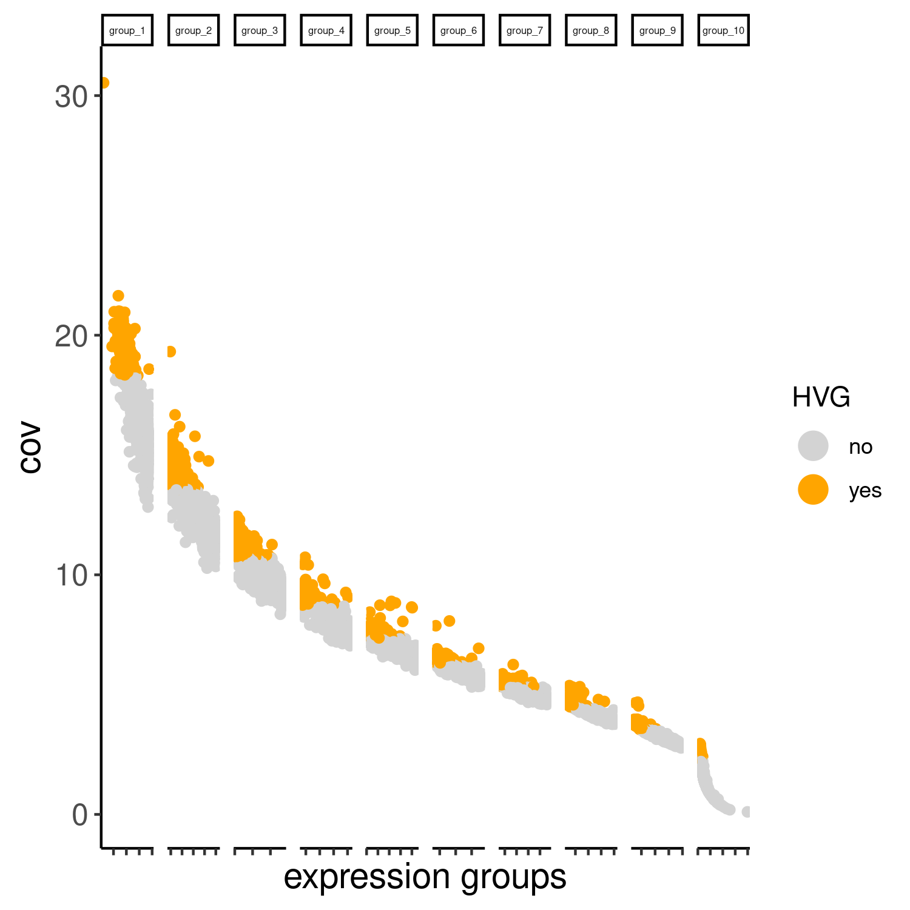
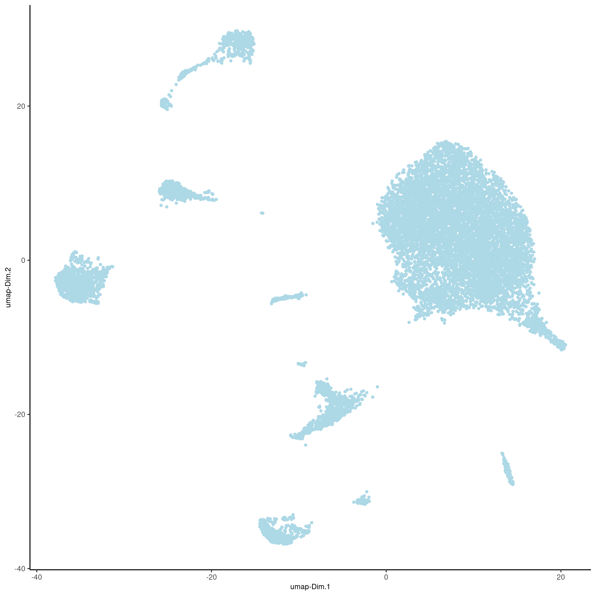
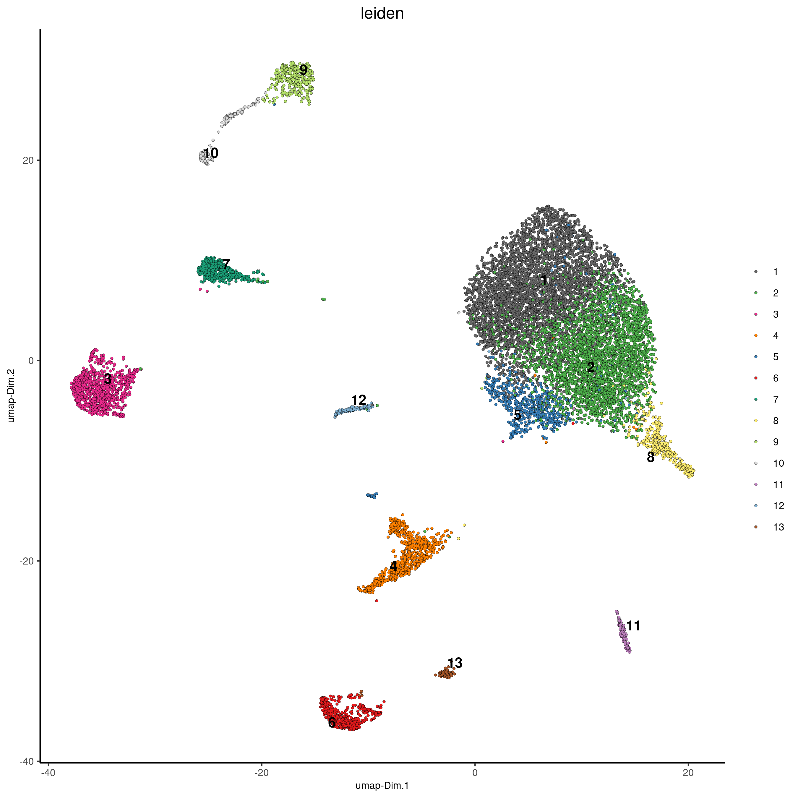
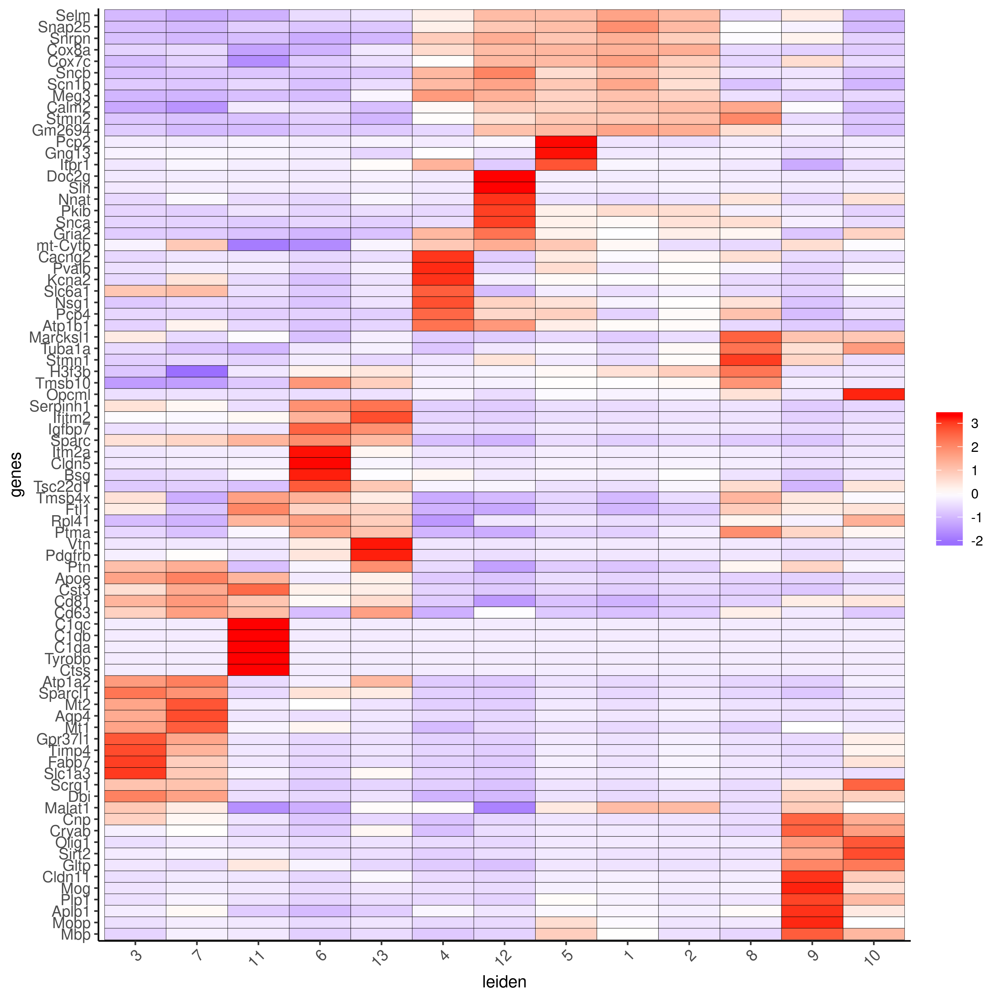
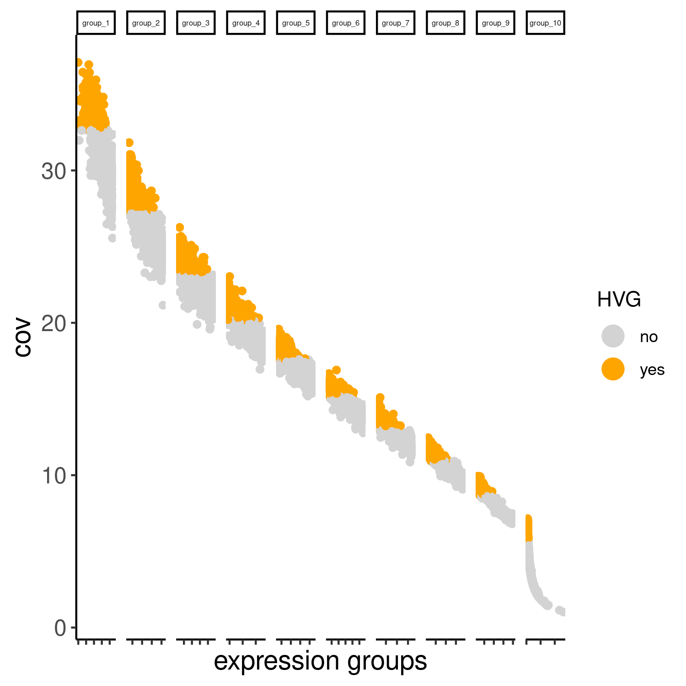
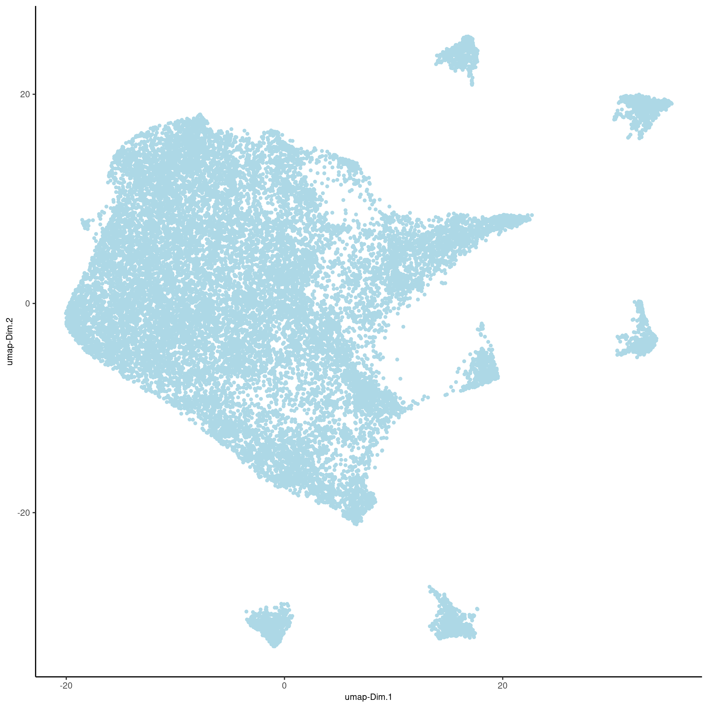
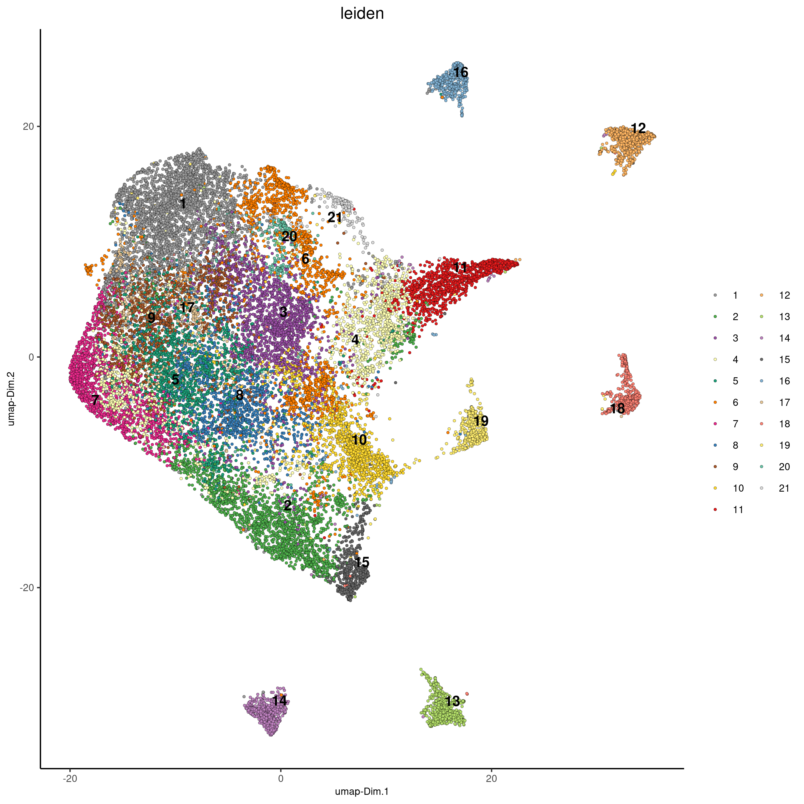
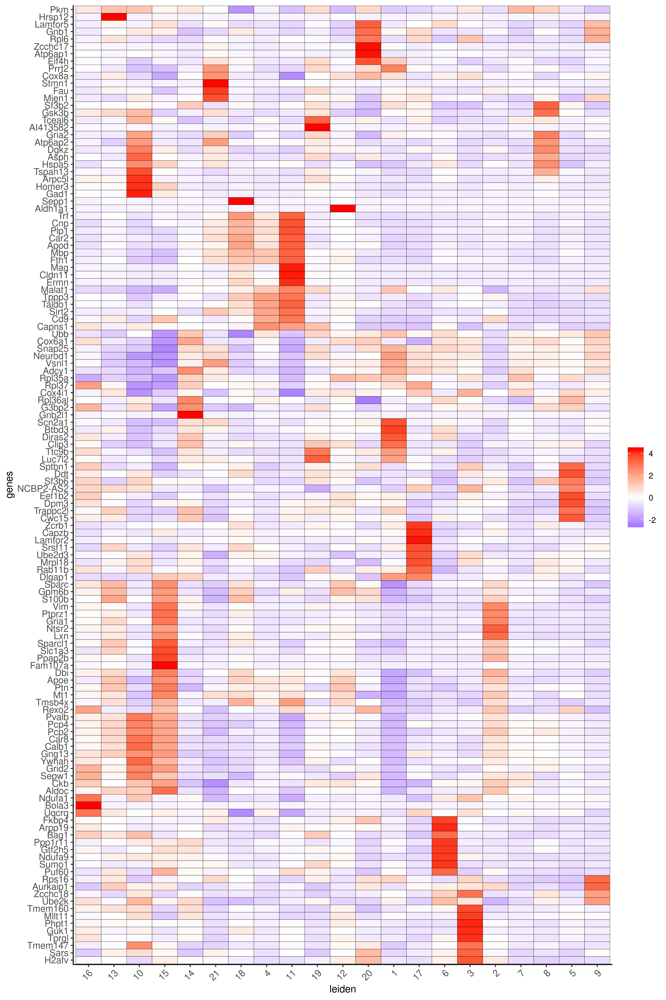
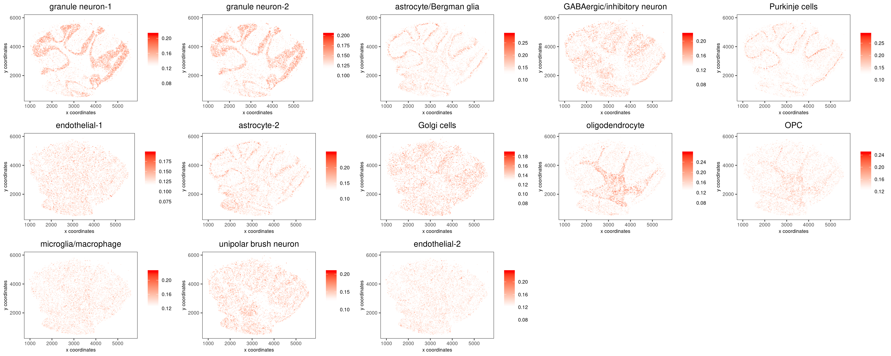

## Slideseq Dataset - Part 1. Cell Type Enrichment

This section will illustrate the cell type enrichment analysis. We will start with the scRNAseq dataset, perform clustering to find cell types, show how to generate cell type signature matrix to be used for cell type enrichment. Finally, we will apply on the slideSeq cerebellum dataset to deconvolve cell types in individual beads. In the analysis of scRNAseq, the input is the count matrix (single-cell). No cell type information is needed.

### Single-cell RNAseq

Giotto can be used to analyze scRNAseq as well. The scRNAseq comes from http://mousebrain.org/ from the the Linnarsson Lab. We will use the cerebellum portion of the atlas in counts.

#### Dataset loading
```R
library(Giotto)
# If Docker, do setwd("/data") first
expr<-read.table("l1.cerebellum.txt")
cell_names<-data.table::fread("l1.cerebellum.cellID.txt", header=F)
gene_names<-data.table::fread("l1.cerebellum.genes.txt", header=F)
gene_names[, dupl := duplicated(V1)]
gene_names[, newV1 := ifelse(dupl == F, V1, paste0(V1,'_',1:.N)), by = V1]
cell_names[, dupl:=duplicated(V1)]
cell_names[, newV1:=ifelse(dupl==F,V1, paste0(V1, "_",1:.N)), by=V1]
colnames(expr) = cell_names$newV1
rownames(expr) = gene_names$newV1
```

#### Preprocessing
```R
workdir = "results"
myinst=createGiottoInstructions(save_plot=T, show_plot=F, save_dir=workdir, is_docker=TRUE) #For docker, add is_docker=TRUE. For ubuntu, add is_ubuntu=TRUE.
cere_rnaseq <- createGiottoObject(raw_exprs = as.matrix(expr), instructions=myinst)
cere_rnaseq <- filterGiotto(gobject=cere_rnaseq, gene_det_in_min_cells=30, min_det_genes_per_cell=300)
cere_rnaseq <- normalizeGiotto(gobject = cere_rnaseq, scalefactor = 10000, verbose = T)
cere_rnaseq <- addStatistics(gobject = cere_rnaseq)
cere_rnaseq <- adjustGiottoMatrix(gobject = cere_rnaseq, expression_values = c('normalized'), batch_columns = NULL, covariate_columns = c('nr_genes', 'total_expr'),  return_gobject = TRUE, update_slot = c('custom'))
```

#### HVG selection, PCA, UMAP, and Leiden clustering to define cell types
```R
cere_rnaseq <- calculateHVG(gobject = cere_rnaseq, method = 'cov_groups', zscore_threshold = 0.5, nr_expression_groups = 10, reverse_log_scale=F, save_param = list(save_name="3_a_HVGplot", base_height=5, base_width=5))
gene_metadata = fDataDT(cere_rnaseq)
featgenes = gene_metadata[hvg == 'yes']$gene_ID
cere_rnaseq <- runPCA(gobject = cere_rnaseq, expression_values = 'custom', genes_to_use = featgenes, scale_unit = F, method="factominer", center=T)
cere_rnaseq <- runUMAP(cere_rnaseq, dimensions_to_use=1:25, n_components=2)
plotUMAP(gobject=cere_rnaseq, point_size=1, save_param = list(save_name = '3_c_UMAP_reduction'))
cere_rnaseq<-createNearestNetwork(gobject=cere_rnaseq, dimensions_to_use=1:25, k=25)
cere_rnaseq<-doLeidenCluster(gobject=cere_rnaseq, resolution=0.75, n_iterations=200, name="leiden")
plotUMAP(cere_rnaseq, cell_color="leiden", point_size=1, save_param = list(save_name = '4_a_UMAP_leiden'))
```






#### Identification of marker genes for cell types
```R
library(scran)
markers_scarn=findMarkers_one_vs_all(gobject=cere_rnaseq, method="scran", expression_values="custom", cluster_column="leiden", min_genes=5)
markergenes_scran = unique(markers_scarn[, head(.SD, 8), by="cluster"][["genes"]])
plotMetaDataHeatmap(cere_rnaseq, expression_values="custom", metadata_cols=c("leiden"), selected_genes=markergenes_scran, save_param = c(save_name = '6_b_metaheatmap_scran'))
```

Legend:
**4**: GABAergic interneuron, **6**: endothelial cells 1, **13**: endothelial cells 2, **11**: microglia/macrophages, **3,7**: astrocyte-1 and astrocyte-2 or Bergmann Glia, **12**: unipolar brush neurons, **1,2**: neurons (granule), **5**: Punkinje cells, **8**: Golgi cells, **9**: oligodendrocytes, **10**: OPC

* * *

<br>

### Slide-seq dataset

We download the cerebellum Slide-seq dataset from Broad institute single-cell portal.

#### Dataset loading
```R
bead_positions <- data.table::fread(file="../../BeadLocationsForR.csv")
expr_matrix<-data.table::fread(file="../../MappedDGEForR.csv")
expr_mat = as.matrix(expr_matrix[,-1]);rownames(expr_mat) = expr_matrix$Row
Slide_test <- createGiottoObject(raw_exprs = expr_mat, spatial_locs = bead_positions[,.(xcoord, ycoord)], instructions=myinst)
filterCombinations(Slide_test, expression_thresholds = c(1, 1), gene_det_in_min_cells = c(20, 20, 20), min_det_genes_per_cell = c(20, 32, 100))
Slide_test<-filterGiotto(gobject=Slide_test, gene_det_in_min_cells=20, min_det_genes_per_cell=20)
non_mito_genes = grep(pattern = 'mt-', Slide_test@gene_ID, value = T, invert = T)
non_mito_or_blood_genes = grep(pattern = 'Hb[ab]', non_mito_genes, value = T, invert = T)
Slide_test = subsetGiotto(gobject = Slide_test, gene_ids = non_mito_or_blood_genes)
spatPlot(Slide_test, point_size=0.5)
Slide_test <- normalizeGiotto(gobject = Slide_test, scalefactor = 2000, verbose = T)
Slide_test <- addStatistics(gobject = Slide_test)
Slide_test <- calculateHVG(gobject = Slide_test, method = 'cov_groups', zscore_threshold = 0.5, nr_expression_groups = 10, save_param=list(save_name="slideseq_HVGplot", base_height=5, base_width=5))
gene_metadata = fDataDT(Slide_test)
featgenes = gene_metadata[hvg == 'yes']$gene_ID
```




#### PCA, UMAP, and clustering
```R
Slide_test <- adjustGiottoMatrix(gobject = Slide_test, expression_values = c('normalized'), batch_columns = NULL, covariate_columns = c('nr_genes', 'total_expr'),  return_gobject = TRUE, update_slot = c('custom'))
Slide_test <- runPCA(gobject = Slide_test, expression_values = 'custom', genes_to_use = featgenes, scale_unit = F, center=T, method="factominer")
Giotto::plotPCA(gobject=Slide_test)
Slide_test <- runUMAP(Slide_test, dimensions_to_use=1:9, n_components=2)
plotUMAP(gobject=Slide_test, point_size=1, save_param = list(save_name = 'slideseq_UMAP'))
Slide_test<-createNearestNetwork(gobject=Slide_test, dimensions_to_use=1:9, k=20)
Slide_test<-doLeidenCluster(gobject=Slide_test, resolution=0.6, n_iterations=10, name="leiden")
plotUMAP(gobject=Slide_test, cell_color="leiden", point_size=1, save_param = list(save_name = 'slideseq_UMAP_leiden'))
markers_scarn=findMarkers_one_vs_all(gobject=Slide_test, method="scran", expression_values="custom", cluster_column="leiden", min_genes=5)
markergenes_scran = unique(markers_scarn[, head(.SD, 8), by="cluster"][["genes"]])
plotMetaDataHeatmap(Slide_test, expression_values="custom", metadata_cols=c("leiden"), selected_genes=markergenes_scran, save_param = c(save_name = 'slideseq_metaheatmap_scran'))
```




#### Cell type enrichment analysis (RANK method)

This is the main section. We first intersect the two datasets to find common genes. Then we define the rank signature matrix (genes by cell types) on the scRNAseq dataset. We call the runRankEnrich function to perform the enrichment analysis.

```R
common_genes=intersect(rownames(cere_rnaseq@raw_exprs), rownames(Slide_test@raw_exprs))
cere_rnaseq2 = subsetGiotto(cere_rnaseq, gene_ids = common_genes)
annot=c("granule neuron-1", "granule neuron-2", "astrocyte/Bergman glia", "GABAergic/inhibitory neuron", "Purkinje cells", "endothelial-1", "astrocyte-2", "Golgi cells", "oligodendrocyte", "OPC", "microglia/macrophage", "unipolar brush neuron", "endothelial-2")
rank_matrix=makeSignMatrixRank(sc_matrix=cere_rnaseq2@raw_exprs, sc_cluster_ids=pDataDT(cere_rnaseq2)$leiden, ties.method="random")
Slide_test<-runRankEnrich(Slide_test, sign_matrix=rank_matrix, expression_values="norm", reverse_log_scale=F, logbase=2, output_enrichment="original", name="rank", rbp_p=0.99, num_agg=100, ties.method="random")
colnames(Slide_test@spatial_enrichment$rank) <- c("cell_ID", annot)
spatCellPlot(gobject = Slide_test, spat_enr_names = 'rank', cell_annotation_values = annot, cow_n_col = 5, coord_fix_ratio = NULL, point_size=0.5, point_border_stroke=0, cell_color_gradient=c("white", "white", "red"), save_param=c(save_name="rank", base_width=20, base_height=8))
```

